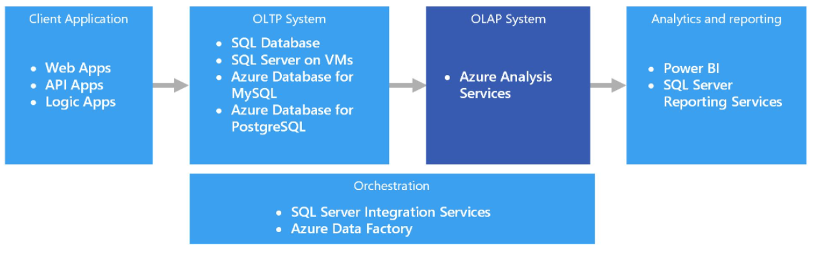

# Self-guided_PowerBI

> __Warning__  In Progress!

# Project objective

- DataScienceAcademy has some courses on Data Analysis using PowerBI:
	- Microsoft Power BI for Data Science, Version 2.0 - Workload: 72h - COMPLETE 🤘
	- Advanced Power BI for Data Analysis with DAX - Workload: 70h - In Progress...

# Technologies:
- PowerBI
	- DAX Studio 3.0.5
	- Bravo BI 1.0.1 (1.0.8381.30060)
- Microsoft SQL Server Management Studio (SSMS) 18.12.1
- Azure Data Studio 1.40.1
- Tableau 2022.3

---

4 kinds of Data Analysis:

	- Descriptive: what happened
	- Diagnostic: why did it happen
	- Predictive: what will happen
	- Prescriptive analysis: what must be done

	PowerBI targets Diagnostic and Prescriptive analysis primarily

	After you feed some data, your choose of data viz is similar to Tableau. It automatically formats the data to the best of its ability
	- Drill up and down to change data clustered in different hierarchys (modificar a granularidade)
	- Always check the encoding and the regional settings, as they may interfere in accents or comma/dot standards

	PowerBI Desktop workflow
	1) Define the problem
	2) Data preparation (Query editor)
	3) Data modelling (Relationship View / Data View)
	4) Data viz (Report View)

---

1st Case Study: Car sales

Creating a dashboard.
- Dashboards connect all kinds of different metrics, data sources, APIs, and services to help companies extract relevant information from those sources and display it in user-friendly ways. Like a car’s dashboard, data dashboards organize and display important information at a glance to help you understand your company’s most valuable data and unearth answers to crucial questions.

- After loading the car sales data, notice that the 'year' column is marked as numeric. This will hinder our ability to correctly display, for example, sales per year, since we don't currently have "labels", but numeric values which PowerBI will automatically sum (in Fields).
- So change it duh!
- With a clustered column chart, now we need some additional formatting: font size, style etc
- Bear in mind that the x-axis is ordered by total sales, but we want it by year: 3 dots --> sort by --> etc. Also reverse the order.

---

- We want to see the total sales by state and if the sales are above or below the average.
	- let's add the average to the existing graph. It's the lens in Visualizations panel. We now see the above or below _by_ _year_. 2019 was the only year above average.

---

- Now we need the cost of vehicle delivery by maker. A pie chart will do nicely.

---

- Cost of labor by State
	- Can be seen as a map.
	- Make sure that on the Data tab the column of states has indeed that data category (otherwise viz wont work). Use the column tools in ribbon.

---

- General total sales and Matrix of sales
	- the card item is adequate for a single information: the sum of all sales
	- a matrix table will be useful by detailing (cost of delivery + cost + sales) per maker

---

With the formatting done, it can now be published in the workspace of powerBI.
How handy! https://app.powerbi.com/groups/me/reports/8ef65a14-7b2a-4392-bf5f-347172502a5e/ReportSection

     

---
---
---

# Advanced Power BI for Data Analysis with DAX

Data that is being used in a Client Application is usually stored in an OLTP System (e.g. SQL Server). However, to create solutions for Data Warehouses or Business Intelligence,
this data is usually transfered to an OLAP (OnLine Analytic Processing) System (e.g. Azure Anallysis Services).

- OLTP (OnLine Transaction Processing)
	- Management of transactional data (enrollment, payments, etc) with references to other data (students, teachers, courses, etc.)
		- The former refers to inputs (usually organized by time). The latter refers to dimensions.
		- Thus we usually group the former by the latter.
	- A lot of common users (those who feed the transactional system), highly normalized (i.e. reduced redundancy), updatable, tabular. Queries to access thousands of registries.
	- Challenges:
		- Might not be adequate to manipulate big volumes of data
		- Might require a lot of processing power (due to the system being highly normalized)
		- Storage of excessive data or by indeterminate timespan might lower the performance of queries.
- OLAP (OnLine Analytic Processing)
	- Performance is the name of the game, so it doesn't need to be normalized.

-